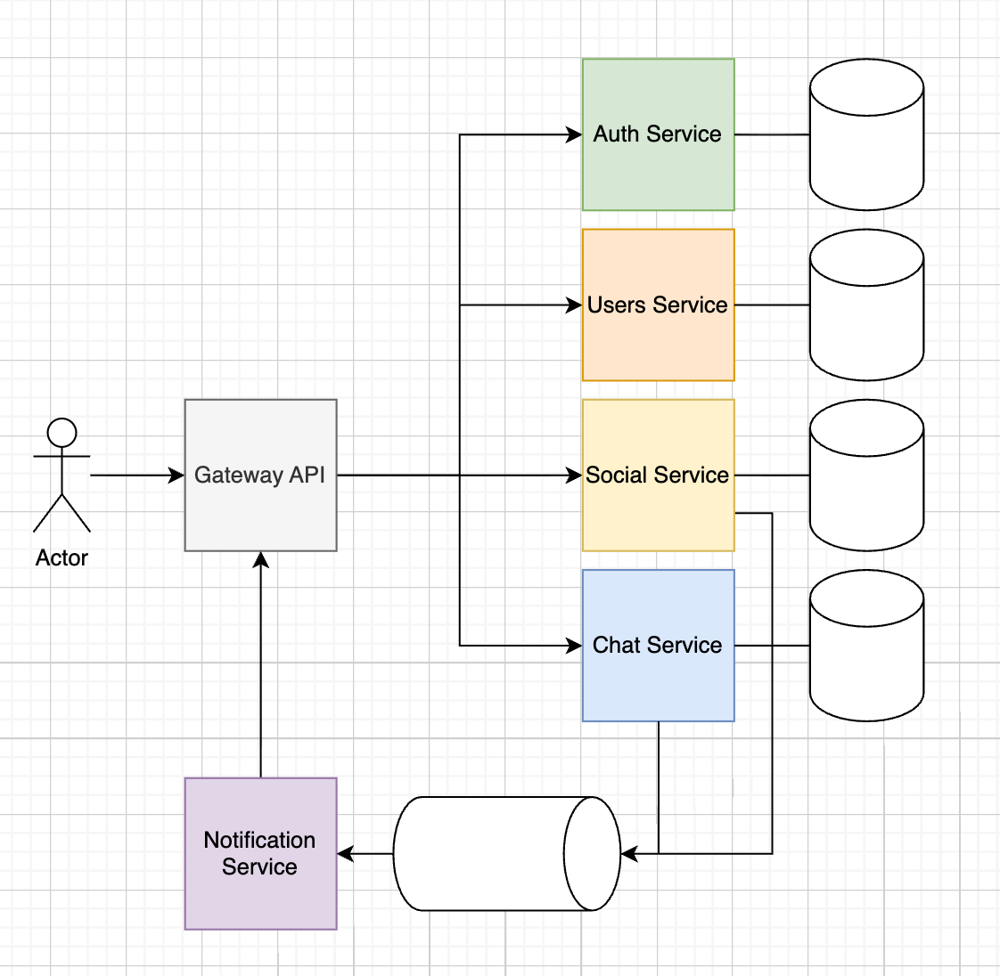

# Домашнее задание №1

В рамках курса вы разработаете учебный микросервисный проект — **мини‑мессенджер** (аналог Discord, только с личными чатами).

Цель — потренировать практики BigTech‑уровня и закрепить темы курса. В конце курса у вас должен получиться итоговый проект, который можно использовать в качестве портфолио.

---

## Мессенджер: бизнес‑возможности

* **Пользователи:**

  * Регистрация по `email` и `password`.
  * Логин по `email` и `password`.
  * Получение и редактирование профиля (`nickname`, `bio`, `avatar_url`).
  * Поиск пользователей по `nickname`.

* **Друзья:**

  * Отправить заявку в друзья.
  * Принять или отклонить заявку.
  * Удалить пользователя из друзей.
  * Просмотр списка друзей.
  * Просмотр заявок в друзья.

* **Личные чаты 1‑к‑1:**

  * Отправка сообщений.
  * Получение истории сообщений.
  * Серверный стрим новых сообщений.

---

## Архитектура и сервисы

Проект состоит из следующих gRPC‑сервисов:

* `API‑Gateway` — единственная публичная HTTP‑точка (REST API). Делает REST→gRPC маппинг, валидирует JWT через Auth.
* `Auth Service` — регистрация, логин, валидация JWT токенов.
* `User Service` — профили пользователей и поиск.
* `Social Service` — добавление в друзья и работа со списком друзей.
* `Chat Service` — работа с чатами и личными сообщениями.
* `Notification Service` — (будет использоваться позже для уведомлений).

---

## Контракты gRPC

### Auth Service

**Ответственность:** регистрация, логин, валидация токена.

| RPC      | Request             | Response                                    | Назначение               | Ошибки                             |
| -------- | ------------------- | ------------------------------------------- | ------------------------ | ---------------------------------- |
| Register | { email, password } | { user\_id }                                | Регистрация              | ALREADY\_EXISTS, INVALID\_ARGUMENT |
| Login    | { email, password } | { access\_token, refresh\_token, user\_id } | Выдать JWT токены        | UNAUTHENTICATED, INVALID\_ARGUMENT |
| Refresh  | { refresh\_token }  | { access\_token, refresh\_token, user\_id } | Перевыпустить JWT токены | UNAUTHENTICATED, INVALID\_ARGUMENT |

---

### User Service

**Ответственность:** управление профилем пользователя.

| RPC                  | Request                                     | Response                   | Назначение             | Ошибки                             |
| -------------------- | ------------------------------------------- | -------------------------- | ---------------------- | ---------------------------------- |
| CreateProfile        | { user\_id, nickname, bio?, avatar\_url? }  | UserProfile                | Создать профиль        | ALREADY\_EXISTS, INVALID\_ARGUMENT |
| UpdateProfile        | { user\_id, nickname?, bio?, avatar\_url? } | UserProfile                | Обновить профиль       | ALREADY\_EXISTS, NOT\_FOUND        |
| GetProfileByID       | { id }                                      | UserProfile                | Получить профиль по ID | NOT\_FOUND                         |
| GetProfileByNickname | { nickname }                                | UserProfile                | Поиск по нику          | NOT\_FOUND                         |
| SearchByNickname     | { query, limit }                            | { results:\[UserProfile] } | Поиск пользователей    | —                                  |

**Особенности:**

* `nickname` уникален, формат `^[a-z0-9_]{3,20}$`.

---

### Social Service

**Ответственность:** добавление в друзья, отклонение, удаление, списки.

| RPC                  | Request                      | Response                                     | Назначение                     | Ошибки                                         |
| -------------------- | ---------------------------- | -------------------------------------------- | ------------------------------ | ---------------------------------------------- |
| SendFriendRequest    | { user\_id }                 | FriendRequest(request\_id, status: PENDING)  | Отправить заявку               | INVALID\_ARGUMENT, ALREADY\_EXISTS, NOT\_FOUND |
| ListRequests         | { user\_id }                 | { requests:\[FriendRequest] }                | Входящие заявки                | —                                              |
| AcceptFriendRequest  | { request\_id }              | FriendRequest(request\_id, status: ACCEPTED) | Принять заявку                 | NOT\_FOUND, PERMISSION\_DENIED                 |
| DeclineFriendRequest | { request\_id }              | FriendRequest(request\_id, status: DECLINED) | Отклонить заявку               | NOT\_FOUND, PERMISSION\_DENIED                 |
| RemoveFriend         | { user\_id }                 | {}                                           | Удалить пользователя из друзей | NOT\_FOUND                                     |
| ListFriends          | { user\_id, limit, cursor? } | { friend\_user\_ids, next\_cursor? }         | Список друзей                  | —                                              |

---

### Chat Service

**Ответственность:** управление чатами и отправка сообщений.

| RPC              | Request                        | Response                               | Назначение                      | Ошибки                                |
| ---------------- | ------------------------------ | -------------------------------------- | ------------------------------- | ------------------------------------- |
| CreateDirectChat | { participant\_id }            | { chat\_id }                           | Создать личный чат              | ALREADY\_EXISTS, INVALID\_ARGUMENT    |
| GetChat          | { chat\_id }                   | Chat                                   | Получить информацию о чате      | NOT\_FOUND, PERMISSION\_DENIED        |
| ListUserChats    | { user\_id }                   | { chats: \[Chat] }                     | Получить список чатов           | —                                     |
| ListChatMembers  | { chat\_id }                   | { user\_ids: \[string] }               | Получить участников             | —                                     |
| SendMessage      | { chat\_id, text }             | Message                                | Отправить сообщение             | INVALID\_ARGUMENT, PERMISSION\_DENIED |
| ListMessages     | { chat\_id, limit, cursor? }   | { messages:\[Message], next\_cursor? } | История сообщений               | —                                     |
| StreamMessages   | { chat\_id, since\_unix\_ms? } | stream Message                         | Серверный стрим новых сообщений | —                                     |

---

### Gateway

**REST API:** реализуется через `grpc-gateway`, вызывает другие сервисы строго по gRPC.

Примеры REST-маршрутов:

* `POST /v1/register` → `AuthService.Register`
* `POST /v1/login` → `AuthService.Login`
* `GET /v1/profile/{id}` → `UserService.GetProfileByID`
* `GET /v1/users/search?query=` → `UserService.SearchByNickname`
* `POST /v1/friends/{user_id}/request` → `SocialService.SendFriendRequest`
* `POST /v1/chats/{chat_id}/message` → `ChatService.SendMessage`

---

## Особенности и рекомендации

### Пагинация

Во всех RPC, где возможна выдача множества элементов (`ListFriends`, `ListMessages`, `SearchByNickname`), используйте пагинацию.

Рекомендуется **cursor-based** подход:

* `limit`: сколько элементов вернуть.
* `cursor`: маркер начала следующей страницы (например, `message_id`, `created_at`).
* `next_cursor`: передаётся в ответе.

### Версионирование API

Во всех RPC и REST методах заложите версионирование:

- `api.auth.v1.AuthService.Register` 
- `POST /v1/register`

---

## Сценарии

1. Регистрация и создание профиля

- Пользователь отправляет запрос Register(email, password) в Auth Service.
- Auth Service возвращает user_id и токены.
- Сразу после — запрос CreateProfile(user_id, nickname) в User Service.
- Профиль успешно создаётся.

2. Логин

- Пользователь логинится через Login(email, password) → получает access_token, refresh_token, user_id.

3. Поиск пользователя по нику

- Пользователь отправляет SearchByNickname(query) → получает список подходящих профилей.

4. Отправка заявки в друзья

- Пользователь (A) отправляет SendFriendRequest(user_id_B) в Social Service.
- Пользователь (B) получает заявку через ListRequests().

5. Принятие заявки

- Пользователь (B) вызывает AcceptFriendRequest(request_id) → пользователи становятся друзьями.

(по желанию) можно протестировать, что оба пользователя теперь есть в ListFriends() друг друга.

6. Удаление из друзей

- Пользователь вызывает RemoveFriend(user_id) → связь разрывается.

7. Отправка сообщения

- Пользователь вызывает SendMessage(chat_id, text) → сообщение сохраняется.
- Другой пользователь может получить его через ListMessages(chat_id) или StreamMessages(chat_id).

8. Получение истории сообщений

- Пользователь вызывает ListMessages(chat_id, limit, cursor) → получает список сообщений с пагинацией.

9. Получение списка чатов

- Пользователь вызывает ListChats() → получает список активных chat_id, с кем был диалог.

---

## Инструкция к ДЗ

В этом ДЗ вы создаёте **скелет микросервисной архитектуры**:

1. **Создайте mono-repo**, в нём:

   * Папки по сервисам: `auth`, `users`, `social`, `chat`, `gateway`.
   * В каждом сервисе отдельный `go.mod`, структура с `cmd/`, `internal/`, `proto/`, `api/`.

2. **Реализуйте:**

   * Протофайлы gRPC для всех сервисов (по описанию выше).
   * gRPC-серверы с заглушками (`main.go` + `impl.go` + пустые хендлеры).
   * `gateway` может использовать `grpc-gateway` и маппить REST API на gRPC вызовы или вы можете использовать любой другой HTTP фреймворк.
   * Все вызовы других сервисов из gateway — строго по gRPC.

3. **Сборка:**

   * Напишите `Dockerfile` для каждого сервиса.
   * Напишите `docker-compose.yaml`, поднимающий всё в одной сети.

4. **Ограничения:**

   * **Не реализовывать** бизнес-логику.
   * **Не реализовывать** работу с токенами.
   * **Не подключать БД**.
   * Контракты — строго по заданным таблицам.

---

### Дополнительно
- ⭐ В gateway поднять Swagger UI и дать возможность вызывать методы из Swagger UI;
